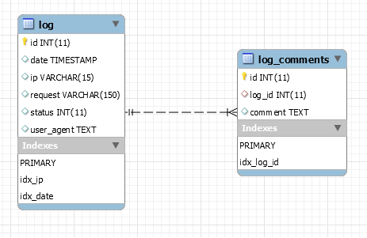

The goal is to write a parser in Java that parses web server access log file, loads the log to MySQL and checks if a given IP makes more than a certain number of requests for the given duration. 

Java
----

(1) Create a java tool that can parse and load the given log file to MySQL. The delimiter of the log file is pipe (|)

(2) The tool takes "startDate", "duration" and "threshold" as command line arguments. "startDate" is of "yyyy-MM-dd.HH:mm:ss" format, "duration" can take only "hourly", "daily" as inputs and "threshold" can be an integer.

(3) This is how the tool works:

    java -cp "parser.jar" com.ef.Parser --startDate=2017-01-01.13:00:00 --duration=hourly --threshold=100
	
	The tool will find any IPs that made more than 100 requests starting from 2017-01-01.13:00:00 to 2017-01-01.14:00:00 (one hour) and print them to console AND also load them to another MySQL table with comments on why it's blocked.

	java -cp "parser.jar" com.ef.Parser --startDate=2017-01-01.13:00:00 --duration=daily --threshold=250

	The tool will find any IPs that made more than 250 requests starting from 2017-01-01.13:00:00 to 2017-01-02.13:00:00 (24 hours) and print them to console AND also load them to another MySQL table with comments on why it's blocked.


SQL
---

(1) Write MySQL query to find IPs that mode more than a certain number of requests for a given time period.

    Ex: Write SQL to find IPs that made more than 100 requests starting from 2017-01-01.13:00:00 to 2017-01-01.14:00:00.

(2) Write MySQL query to find requests made by a given IP.
 	

LOG Format
----------
Date, IP, Request, Status, User Agent (pipe delimited, open the example file in text editor)

Date Format: "yyyy-MM-dd HH:mm:ss.SSS"

Also, please find attached a log file for your reference. 

The log file assumes 200 as hourly limit and 500 as daily limit, meaning:

(1) 
When you run your parser against this file with the following parameters

    java -cp "parser.jar" com.ef.Parser --startDate=2017-01-01.15:00:00 --duration=hourly --threshold=200

The output will have 192.168.11.231. If you open the log file, 192.168.11.231 has 200 or more requests between 2017-01-01.15:00:00 and 2017-01-01.15:59:59

(2) 
When you run your parser against this file with the following parameters

    java -cp "parser.jar" com.ef.Parser --startDate=2017-01-01.00:00:00 --duration=daily --threshold=500

The output will have  192.168.102.136. If you open the log file, 192.168.102.136 has 500 or more requests between 2017-01-01.00:00:00 and 2017-01-01.23:59:59


Deliverables
------------

(1) Java program that can be run from command line
	
    java -cp "parser.jar" com.ef.Parser --accesslog=/path/to/file --startDate=2017-01-01.13:00:00 --duration=hourly --threshold=100 

(2) Source Code for the Java program

(3) MySQL schema used for the log data

(4) SQL queries for SQL test


## Result:
---

App was created using Java 8, Spring boot and Maven.

Database schema is generated by liquibase. If DB does not exist, liquibase creates it from schema defined in liquibase-changelog.xml.

Database configuration can be done via applications.properties.

To compile app to .jar 

```
mvn package
``` 

Application can be run with defined parameters 

```
java -jar target/parser-0.0.1-SNAPSHOT.jar --accesslog=access.log  --startDate=2017-01-01.13:00:00 --duration=hourly --threshold=100
```

After the initial run, accesslog parameter can avoided.


# SQL
---

(1) Write MySQL query to find IPs that made more than a certain number of requests for a given time period.

````mysql
SELECT l.ip 
FROM log l 
WHERE l.date BETWEEN '2017-01-01.13:00:00' AND '2017-01-01.14:00:00'
GROUP BY l.ip 
HAVING count(l.ip) >= 100;
````


(2) Write MySQL query to find requests made by a given IP.

````mysql
SELECT l.* 
FROM log l
WHERE ip = '192.168.102.136';
````


# Deliverables
------------

(1) Java program that can be run from command line
	
    java -cp "parser.jar" com.ef.Parser --accesslog=/path/to/file --startDate=2017-01-01.13:00:00 --duration=hourly --threshold=100 

(2) Source Code for the Java program

    Available in git at https://github.com/MartinLuccanera/LogToMySQL

(3) MySQL schema used for the log data



(4) SQL queries for SQL test

    Described above.
